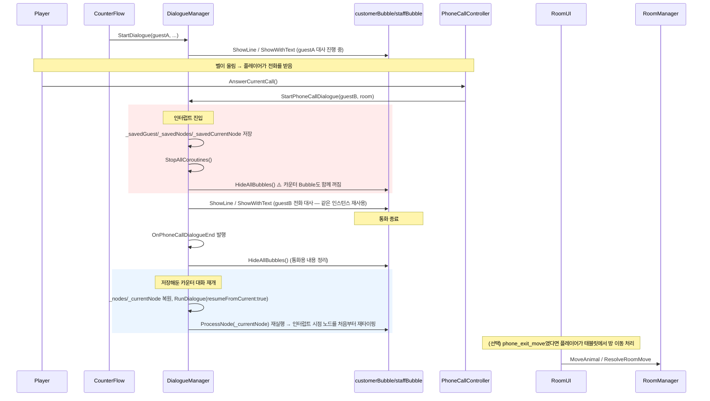

# 카운터 대화 ↔ 전화 대화 Bubble 인터럽트 파이프라인

관련 클래스: `DialogueManager`, `CounterFlow`, `SpeechBubble`, `StaffCombinedBubble`, `PhoneCallController`, `RoomManager`, `RoomUI`

## 1. 배경 — 보고된 증상 2가지

1. **"덮는 느낌"이 없다**: 손님을 응대하던 도중 민원 전화가 오면, 전화 대화가 기존 손님 응대 화면을 **덮어씌우는(Cover)** 느낌이어야 하는데, 실제로는 기존 손님 Bubble이 통째로 **꺼져버려서** 인터럽트가 아니라 그냥 "대화가 리셋되고 새로 시작"하는 것처럼 보인다.
2. **재개 후 Bubble이 안 돌아온다**: 전화 대화가 끝나고 (필요 시) 방을 옮긴 뒤에도, 중단됐던 손님 응대용 Bubble이 다시 켜지지 않아 그 손님과의 대화 내역/진행 상태를 볼 수 없다.

두 증상 모두 "카운터 대화 하나가 진행되는 도중 전화 대화가 끼어드는" 시나리오에서만 발생하며, 원인은 서로 다르다.

## 2. 현재 구조 (As-Is)

핵심 사실: **카운터 대화(`RunDialogue`)와 전화 대화(`RunPhoneCallDialogue`)가 `customerBubble`/`staffBubble` 인스턴스를 그대로 공유한다.** `DialogueManager`에 이 둘을 위한 별도 Bubble 필드가 없다. 씬에서도 `CounterFlow.customerBubble`과 `DialogueManager.customerBubble`이 동일한 GameObject를 가리킨다(`CounterScene.unity` 상 동일 `fileID`).

## 3. 원인 분석

### 3-1. 증상 A — "덮는 느낌"이 없는 이유 (구조적으로 확정된 원인)

`StartPhoneCallDialogue`(`DialogueManager.cs:82-105`)가 인터럽트 진입 시 호출하는 `HideAllBubbles()`(`DialogueManager.cs:270-274`)는 `customerBubble.HideImmediate()` + `staffBubble.HideImmediate()`를 그대로 실행한다. 카운터 대화와 전화 대화가 **같은 GameObject/컴포넌트**를 쓰기 때문에, "전화 Bubble을 그 위에 새로 띄운다"가 아니라 "기존 Bubble의 내용을 지우고 같은 자리에 새 내용을 쓴다"가 되어버린다. 즉 지금 구조에서는 **"덮기"가 기술적으로 불가능하다** — 애니메이션 타이밍 문제가 아니라, 애초에 겹쳐 그릴 별도의 레이어가 없다.

### 3-2. 증상 B — 재개 후 안 보이는 이유 (원인 후보 2가지)

코드를 추적한 결과, `RunDialogue(resumeFromCurrent:true)`(`DialogueManager.cs:107-129`)는 `HideAllBubbles()`를 건너뛰고 곧바로 `ProcessNode(_currentNode)`를 실행하므로, **기술적으로는 Bubble이 다시 켜진다.** 다만 두 가지 실제 결함이 "다시 켜져도 소용없는" 상황을 만든다.

**원인 후보 1 — 재개 시 같은 노드를 처음부터 재생(retype)함.** 인터럽트가 걸린 시점의 `_currentNode`를 그대로 저장했다가 재개 시 `ProcessNode`를 다시 호출하기 때문에, 이미 다 보여줬던 대사도 처음부터 다시 타이핑되거나(`SpeechBubble.TypeText`/`StaffCombinedBubble.TypeText`가 항상 `maxVisibleCharacters = 0`부터 시작), 선택지 노드였다면 버튼을 다시 생성한다. "진행 상태"라는 개념 자체가 저장되지 않는다 — 이 노드가 이미 끝까지 보여졌었는지, 방금 시작했는지 구분이 없다.

**원인 후보 2 (실제 버그, 더 유력함) — 방 이동 경로가 `NotifyRoomAssigned()`를 호출하지 않음.** 카운터 대화 중 "방 배정" 선택지는 `DialogueManager._roomAssigned` 플래그가 `true`여야 활성화된다(`DialogueManager.cs:211-213`, `StaffCombinedBubble.EnableAssignChoices`). 이 플래그는 오직 `RoomUI.OnAssignButtonClicked()`의 **일반 체크인 경로**에서만 켜진다(`RoomUI.cs:196`: `dialogueManager.NotifyRoomAssigned()`). 그런데 전화로 "방을 옮겨드리겠다"고 답한 뒤 실제 이동을 처리하는 **대기 손님 경로**인 `RoomUI.AssignRoomForPendingMove()`(`RoomUI.cs:200-219`)에는 이 호출이 빠져 있다. 인터럽트 당한 시점이 하필 "방 배정" 선택지 노드였다면, 재개된 Bubble은 화면에 다시 나타나지만 **선택지 버튼이 계속 비활성 상태로 멈춰서** 진행이 안 되고, 플레이어 입장에서는 "대화가 다시 안 켜진다"로 보인다. (부수적으로 `RoomUI.OnRoomAssigned` 이벤트도 선언·호출만 되고 구독자가 어디에도 없는 죽은 이벤트로 확인됨 — 원래 이 지점에서 뭔가를 다시 알려주려던 흔적으로 보인다.)

## 4. 옵션 비교 — "덮는" 연출을 어떻게 구현할까 (Trade-off)

| 옵션 | 설명 | 장점 | 단점 |
|---|---|---|---|
| **A. 기존 Bubble 재사용 + sortingOrder만 임시 상향** | 지금 구조 그대로, 전화 시작 시 같은 Bubble의 sortingOrder만 올렸다가 되돌림 | 코드 변경 최소 | **불가능**: 같은 인스턴스이므로 내용을 덮어쓰는 순간 카운터 대사 텍스트 자체가 사라짐. "덮기"가 아니라 "교체"가 됨 |
| **B. 전화 전용 Bubble 신설 (권장)** | `DialogueManager`에 `phoneCustomerBubble`/`phoneStaffBubble` 필드를 추가하고, 전화 대화는 이쪽만 사용. 카운터 Bubble은 인터럽트 중에도 `HideAllBubbles()` 대상에서 제외 | 카운터 대화의 마지막 상태가 화면에 그대로 남아있는 채 전화 Bubble이 그 위(더 높은 sortingOrder)에 뜸 → "덮는" 느낌 정확히 재현. 재개 시 재생 문제(3-2, 후보1)도 자동 완화(이미 보이고 있었으므로) | 새 프리팹/컴포넌트 1~2개 필요, `DialogueManager`가 관리하는 Bubble 종류가 늘어남 |
| **C. 카운터 Bubble을 밀어내는 연출** (예: 화면 하단으로 슬라이드/축소) | 전화가 오면 카운터 Bubble을 완전히 숨기지 않고 작게 줄이거나 구석으로 이동 | 시각적으로 가장 리치함 | 애니메이션 상태(원위치, 축소 배율 등) 관리가 추가로 필요, 구현 비용이 B보다 큼, 이번 버그(증상 B)와는 별개 이슈라 우선순위 낮음 |

**결론**: 옵션 A는 구조적으로 요구사항을 만족할 수 없으므로 제외. **옵션 B**를 우선 적용 권장 — 최소 변경으로 "덮기" 요구사항을 그대로 만족하고, 재개 시 재생 문제도 부수적으로 완화된다. 옵션 C는 이후 폴리싱 단계에서 검토.

## 5. Handling 규칙 (재발 방지)

향후 대화 시스템에 인터럽트 컨텍스트(전화, 알림, 이벤트 등)를 추가할 때 아래 규칙을 적용한다.

1. **Bubble 소유권 분리 규칙**: 서로 다른 대화 컨텍스트(카운터 vs 전화 vs 향후 추가될 것)는 각자의 프레젠테이션 리소스(Bubble)를 소유해야 한다. 하나의 대화 컨텍스트가 실행된다고 해서 다른 컨텍스트의 Bubble을 강제로 `Hide`하지 않는다. "일시정지(코루틴 정지)"와 "숨김(시각적 Hide)"은 별개 개념으로 다룬다.
2. **인터럽트 z-order 규칙**: 인터럽트 대화(전화 등)는 항상 기존 대화보다 높은 sortingOrder/레이어에 렌더링되어야 하며, 기존 대화 Bubble의 `GameObject`는 `SetActive(true)` 상태를 유지한다(내용을 지우지 않는다).
3. **재개 시 진행 상태 보존 규칙**: 인터럽트가 걸린 노드가 이미 완전히 표시된 상태였는지, 타이핑 도중이었는지, 선택지 대기 중이었는지를 저장해서 재개 시 "처음부터 재생"이 아니라 "중단 시점 그대로 이어서" 보여준다. 최소한 "Choice 대기 중이었다면 버튼을 다시 스폰하되 라인 텍스트는 재타이핑하지 않는다" 정도는 지킨다.
4. **게이트 상태 알림 단일 경로 규칙**: `_roomAssigned`처럼 대화 진행을 잠그는 플래그를 해제하는 진입점이 여러 개(일반 체크인 Assign, 대기 손님 Move Assign 등)라면, **모든 진입점이 동일한 알림 메서드**(`DialogueManager.NotifyRoomAssigned()`)를 호출하도록 강제한다. 새 UI 진입점을 추가할 때 "이 액션이 대화 진행 조건을 만족시키는가?"를 체크리스트 항목으로 넣는다.
5. **죽은 이벤트 감사 규칙**: `OnRoomAssigned`처럼 선언·호출은 되지만 구독자가 없는 이벤트를 발견하면, 삭제하거나 원래 의도했던 구독자를 연결한다. 방치하면 "분명 알림이 갔을 것"이라는 잘못된 가정 하에 디버깅 시간이 낭비된다.

## 6. 권장 조치

| 우선순위 | 조치 | 대상 |
|---|---|---|
| 즉시 | `RoomUI.AssignRoomForPendingMove()`에 `dialogueManager.NotifyRoomAssigned()` 호출 추가 (또는 이 경로가 카운터 대화와 무관함을 확인 후 별도 알림으로 대체) | `RoomUI.cs:200-219` |
| 즉시 | `RoomUI.OnRoomAssigned` 죽은 이벤트 정리 — 삭제하거나 원래 의도된 구독자 연결 | `RoomUI.cs:75, 195, 217` |
| 단기 | 옵션 B(전화 전용 Bubble) 도입 — `DialogueManager`에 `phoneCustomerBubble`/`phoneStaffBubble` 필드 추가, `StartPhoneCallDialogue`/`RunPhoneCallDialogue`가 카운터 Bubble의 `HideAllBubbles()`를 호출하지 않도록 분리 | `DialogueManager.cs:82-166, 270-274` |
| 중기 | 재개 시 "이미 완료된 노드 재생 방지" — 인터럽트 시 `_currentNode`가 처리 완료된 상태였는지, 아니면 처리 도중이었는지를 별도 플래그로 저장 | `DialogueManager.cs:107-129` |

## 7. 관련 코드 위치

| 역할 | 파일 | 비고 |
|---|---|---|
| 카운터/전화 대화 공용 Bubble 필드 | `Assets/Scripts/Managers/DialogueManager.cs:11-12` | 분리 대상 |
| 인터럽트 저장/전환 | `Assets/Scripts/Managers/DialogueManager.cs:82-105` (`StartPhoneCallDialogue`) | |
| 재개 로직 | `Assets/Scripts/Managers/DialogueManager.cs:107-129, 131-166` (`RunDialogue`, `RunPhoneCallDialogue`) | |
| 전체 Hide 호출 | `Assets/Scripts/Managers/DialogueManager.cs:270-274` (`HideAllBubbles`) | |
| 방 배정 선택지 게이트 | `Assets/Scripts/Managers/DialogueManager.cs:201-216` (`ProcessChoice`), `Assets/Scripts/Dialogue/StaffCombinedBubble.cs:217-232` (`EnableAssignChoices`) | 텍스트 매칭 방식 자체도 별도 리스크 (다른 문서에서 지적) |
| 일반 체크인 Assign 경로 (알림 O) | `Assets/Scripts/Room/RoomUI.cs:147-198` (`OnAssignButtonClicked`) | line 196에서 `NotifyRoomAssigned()` 호출 |
| 대기 손님 Move Assign 경로 (알림 X) | `Assets/Scripts/Room/RoomUI.cs:200-219` (`AssignRoomForPendingMove`) | `NotifyRoomAssigned()` 누락 |
| 죽은 이벤트 | `Assets/Scripts/Room/RoomUI.cs:75, 195, 217` (`OnRoomAssigned`) | 구독자 없음 |
| 전화벨/응답 진입점 | `Assets/Scripts/Counter/PhoneCallController.cs:157-169, 248-270` | |
| 카운터 대화 종료 대기 | `Assets/Scripts/Managers/CounterFlow.cs:98-174` (`SpawnCustomerRoutine`), 135 (`WaitUntil(_dialogueFinished)`) | 전화 인터럽트로 인한 오작동 없음 확인 (별개 이벤트 사용) |

## 8. 이번 조사에서 배제한 가설

- **CounterFlow 코루틴이 전화 인터럽트로 인해 멈추거나 중복 실행된다**: 확인 결과 아님. `DialogueManager.StopAllCoroutines()`는 해당 컴포넌트 인스턴스에만 적용되고, `CounterFlow`는 `OnDialogueEnd`(전화와 별개인 `OnPhoneCallDialogueEnd`)에만 반응하므로 영향받지 않는다.
- **방 이동(`MoveAnimal`)이 비동기로 지연되며 재개된 대화와 레이스 컨디션을 일으킨다**: 방 이동은 전적으로 플레이어가 태블릿에서 Assign을 누르는 시점에 동기적으로 실행되며, `DialogueManager`/Bubble을 전혀 건드리지 않는다. 레이스 컨디션이 성립할 코드 경로 자체가 없다.
