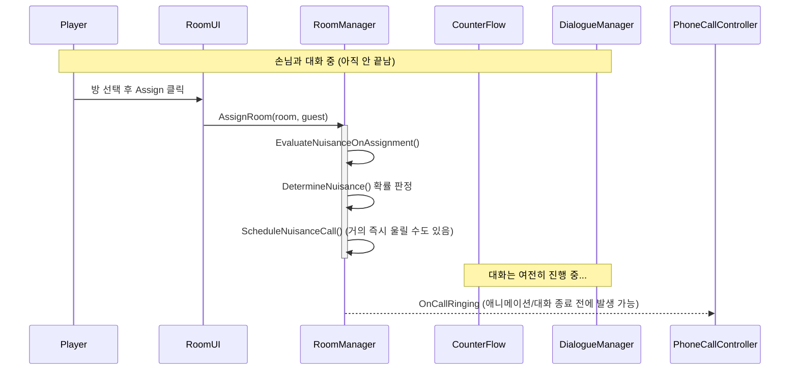
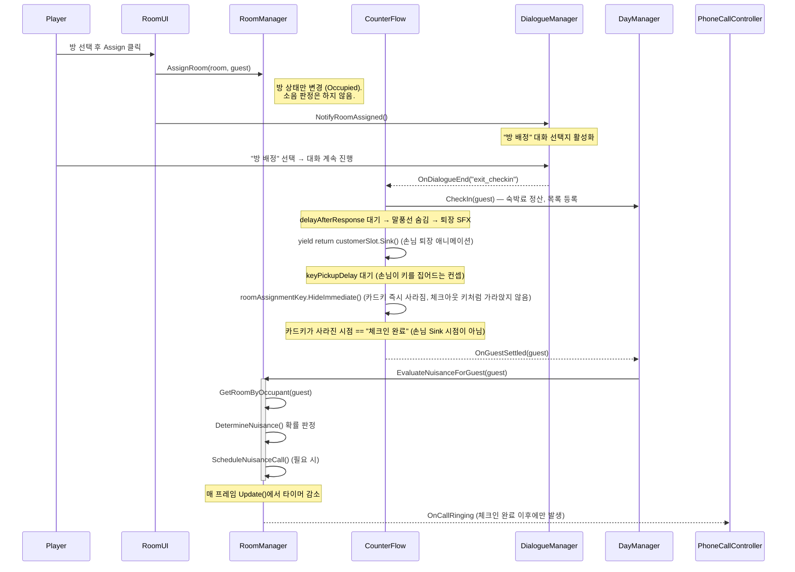
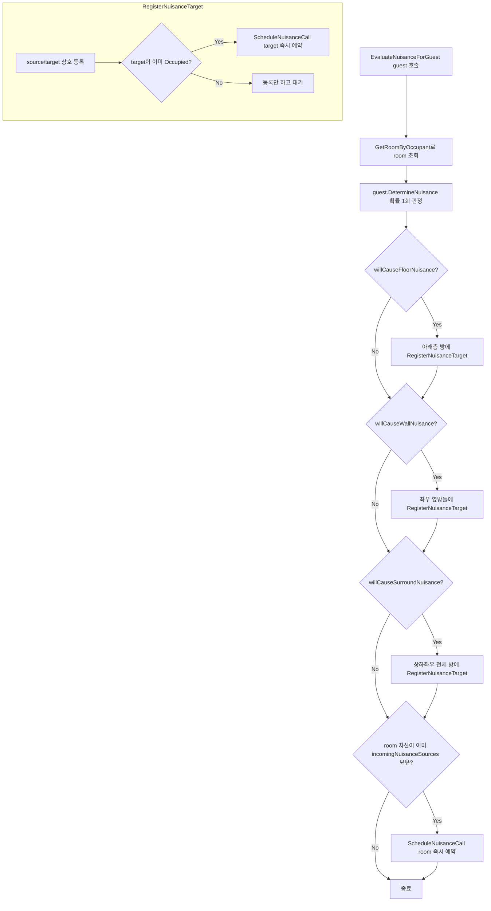
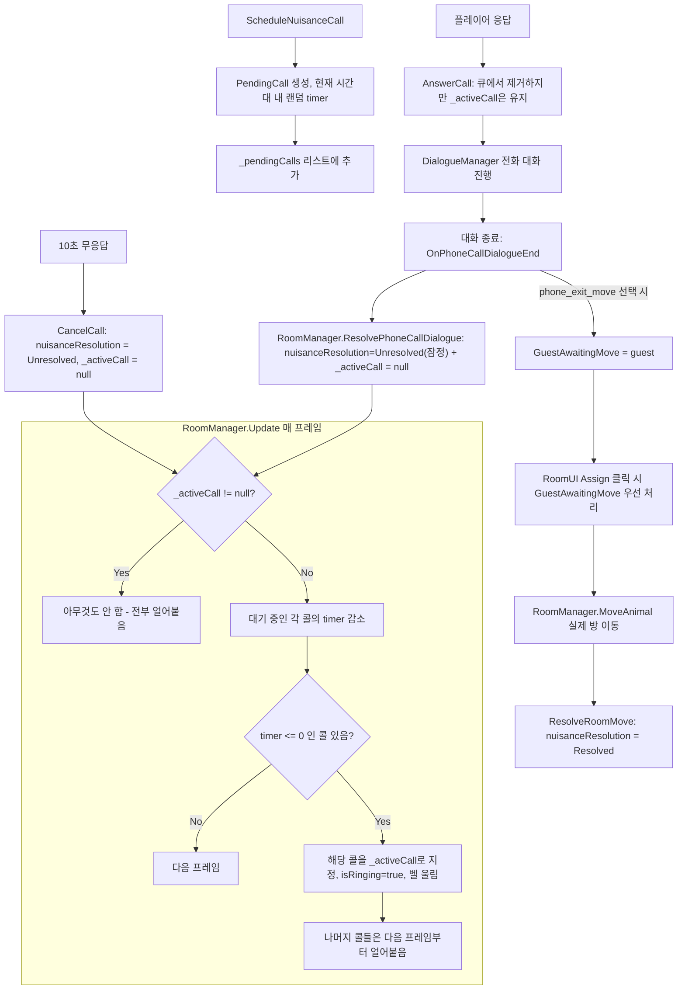

# 소음(Nuisance) → 민원 전화 파이프라인

관련 클래스: `RoomManager`, `CounterFlow`, `DayManager`, `PhoneCallController`, `DialogueManager`

## 1. 배경

기존에는 방을 배정하는 순간(`RoomManager.AssignRoom`) 소음 판정과 민원 전화 예약이 **동기적으로 즉시** 실행됐다. 이 때문에 손님이 체크인 대화·퇴장 애니메이션을 마치기도 전에 — 심지어 대화가 끝나기도 전에 — 전화가 걸리는 문제가 있었다.

**수정 방향**: 소음 판정(`EvaluateNuisanceOnAssignment`)과 그로 인한 전화 예약(`ScheduleNuisanceCall`)을 "방 배정" 시점이 아니라 **"체크인 절차가 완전히 끝난 시점"(대화 종료 + 퇴장 애니메이션 종료)**에 실행되도록 변경했다. `CounterFlow`가 이 시점을 이벤트(`OnGuestSettled`)로 알리고, `DayManager`가 이를 받아 `RoomManager`에 전달하는 구조다.

## 2. 변경 전 (버그가 있던 흐름)

문제 지점: `AssignRoom()`이 방 상태 변경과 소음 판정을 한 메서드 안에서 함께 처리했고, 이 호출은 대화가 끝나기 전(플레이어가 태블릿에서 방을 배정하는 시점)에 이미 발생했다. 게다가 `ScheduleNuisanceCall`의 랜덤 딜레이 하한이 사실상 0에 가까워, 배정 직후 곧바로 벨이 울릴 수 있었다.

## 3. 변경 후 (현재 구조)

## 4. 소음 판정 내부 로직 (`EvaluateNuisanceOnAssignment`)

`RoomManager.EvaluateNuisanceForGuest(guest)` → 내부적으로 기존 `EvaluateNuisanceOnAssignment(room)`을 호출한다. 이 메서드 자체의 판정 로직은 이번 변경에서 그대로 유지됐다.

- **판정은 손님당 1회**만 일어나고(`hasDeterminedNuisance` 플래그), 체크아웃할 때까지 유지된다.
- 이미 입주해 있는 옆방 손님이 새로 배정된 소음원 때문에 피해를 입는 경우는, 그 옆방 손님이 이미 체크인을 마친 상태이므로 즉시 콜을 예약해도 문제가 없다. **이번 변경으로 달라지는 건 오직 "새로 배정된 손님 본인"이 원인 제공자·피해자가 되는 시점뿐**이다.

## 5. 콜 큐: 동시 다발 민원 & 체크아웃 레이스 수정 (2차 변경)

1차 변경 이후에도 두 가지 문제가 남아 있었다.

1. **동시 링잉 버그**: 여러 명이 동시에 소음 피해자가 될 수 있는데(사방 소음은 최대 4개 방에 동시 전파), 기존 `RoomManager.Update()`는 각 콜을 독립된 랜덤 타이머로 돌리면서 "같은 프레임에 울리는 것"만 `minGap`으로 회피했다. A가 통화 중인데 B의 타이머도 다 되면 B는 내부적으로 `isRinging = true`가 되지만, `PhoneCallController`가 이미 A의 벨 애니메이션을 재생 중이라 B의 벨은 화면에 뜨지 않고, `GetActiveRingingCall()`도 항상 A만 찾아내 B가 영원히 처리되지 않는 "유령 콜"이 될 수 있었다.
2. **체크아웃 레이스**: 콜 타이머가 만료되는 시점과, 원인 제공자/피해자가 체크아웃되어 하루가 넘어가는 시점이 서로 조율되지 않아, 벨은 울렸지만 플레이어가 받기도 전에(혹은 대화 중에) 관련 손님이 체크아웃돼 대화 내용이 붕 뜨는 문제가 있었다.

**변경 방향**: "체크아웃 전까지 걸어야 한다"는 마감 계산을 완전히 없애고, 대신 **① 한 번에 하나의 콜만 활성화되도록 큐를 직렬화**하고 **② 밀린 콜이 있으면 다음 시간대(낮/밤)로 아예 넘어가지 못하게** 게이트를 걸었다. 두 조건이 함께 있으면 "언젠가는 반드시, 그리고 한 번에 하나씩만" 처리된다는 게 보장된다.

### 5-1. 방 이동(Move) 후속 처리

전화 대화에서 "빈 방으로 옮겨 드릴게요"(`phone_exit_move`)를 선택해도 그 자체로는 방을 옮기지 않는다 — 약속만 하는 것이고, `nuisanceResolution`은 일단 `Unresolved`로 잠정 기록된다. 대신 `RoomManager.GuestAwaitingMove`에 그 손님이 등록되고, `RoomUI.OnAssignButtonClicked()`는 **체크인 중인 손님보다 이 대기 손님을 우선 처리**한다. 플레이어가 태블릿에서 새 방을 골라 Assign을 누르면 `RoomManager.MoveAnimal()`로 실제 이동이 일어나고, 그제서야 `ResolveRoomMove()`가 `nuisanceResolution`을 `Resolved`로 올린다. 손님이 이동되기 전에 체크아웃해버리면(`VacateRoom`에서 감지) `GuestAwaitingMove`는 조용히 해제되고 평점은 `Unresolved`로 확정된다.

- **_activeCall 하나만 존재**하므로 두 번째 벨이 동시에 울리는 경우 자체가 구조적으로 불가능해졌다.
- **"체크인 중인 다른 손님과의 대화에는 끼어들지만, 다른 전화 통화 중에는 끼어들지 않는다"**는 요구사항도 자동으로 만족된다 — `_activeCall`이 걸려 있는 동안은 애초에 다음 콜이 울리지 않으므로 `DialogueManager.StartPhoneCallDialogue()`가 통화 중에 다시 호출될 일이 없다.
- `DayManager.TryAdvancePhase()`에 `roomManager.HasPendingCalls()` 게이트를 추가해서, 큐에 남아있거나 활성화된 콜이 있으면 시간대 전환 자체가 보류된다. (기존 `counterFlow.IsBusy` 체크와 같은 패턴) `HasPendingCalls()`는 `GuestAwaitingMove != null`(방 이동을 약속해놓고 아직 안 옮긴 손님이 있는 경우)도 함께 확인하므로, "옮겨드리겠습니다"라고 답한 뒤 실제로 방을 옮겨주기 전까지도 시간대가 넘어가지 않는다.
- 남은 대기 콜들은 다음 두 조건 중 하나라도 참이면(`RoomManager.Update()`의 `nothingElseToWaitFor`) 원래 뽑힌 랜덤 쿨타임을 기다리지 않고 매 프레임 `timer = 0`으로 강제되어 즉시(한 번에 하나씩, `_activeCall` 규칙은 그대로 유지) 울린다.
  1. 시간대에 배정된 시간(`PhaseTimeRemaining`)이 이미 0 이하로 소진된 경우
  2. 이번 시간대에 방문 예정이던 손님이 전부 이미 카운터를 다녀간 경우 (`CounterFlow.AllArrivalsVisited` → `DayManager.NoMoreArrivalsThisPhase`)

  2번 조건이 없으면, 마지막 손님이 체크인하자마자 소음 피해자가 되어 콜이 예약될 때 남은 페이즈 시간 전체(예: 32초)를 랜덤 딜레이로 뽑아버려 플레이어가 아무 할 일 없이 그 시간을 그냥 기다려야 하는 문제가 있었다 — 더 이상 방문할 손님이 없다면 그 시점부터는 콜을 바로 처리하는 게 자연스럽다.

## 6. 평점 페널티 (2차 변경)

손님의 소음 민원 결과는 `Animal.nuisanceResolution` (`None` / `Resolved` / `Unresolved`)에 기록되고, 체크아웃 시점(`DayManager.FinalizeCheckoutGuest` → `GetCheckoutRating`)에 반영된다.

| 상황 | `nuisanceResolution` | `nuisanceComplaintCount` | 체크아웃 평점 |
|---|---|---|---|
| 소음 피해 자체가 없었음 | `None` | 0 | `noIssueRatingRange` (기본 9~10 랜덤) |
| 응답 후 실제로 방을 옮겨줌, 그 뒤 새 방에서 다시 문제 없었음 | `Resolved` | 1 | `nuisanceResolvedRatingRange` (기본 7~9 랜덤) |
| 응답 후 방을 옮겨줬는데, 새 방에서도 소음이 재발해 다시 전화가 왔고 그 통화도 결국 다시 옮겨서 해결됨 | `Resolved` | 2+ | `nuisancePartiallyResolvedRatingRange` (기본 4~6 랜덤, "부분 해결") |
| 응답했지만 옮길 방이 없음(`phone_exit_no_move`), 또는 방을 옮겨준다고 해놓고 실제로 옮기기 전에 체크아웃함 | `Unresolved` | 1+ | `nuisanceUnresolvedRatingRange` (기본 1~3 랜덤) |
| 벨이 10초간 무응답으로 자동 취소(`PhoneCallController` 타임아웃 → `CancelCall`) | `Unresolved` | 1+ | `nuisanceUnresolvedRatingRange` (기본 1~3 랜덤) |
| 예약자인데 방이 없어 거절당함(`exit_rejected_no_room`) | 해당 없음 (체크인 전 즉시 처리) | — | `CounterFlow`에서 즉시 0점 고정 |

모든 범위는 `DayManager` Inspector에서 `Vector2Int`로 튜닝 가능하다.

### 6-1. "문제 일부 해결" 등급 구현 완료 (3차 변경)

이전까지는 `hasCalledNuisance`가 한 번 true가 되면 절대 안 풀렸다 — 방을 옮겨줘도, 못 옮겨줘도 그 손님은 체류 기간 중 두 번 다시 전화를 걸지 않았다. 그런데 방을 옮긴 뒤 새 방에서 또 다른 층간/벽간/사방 소음에 시달리는 경우, 그 재발 자체는 `MoveAnimal` → `EvaluateNuisanceOnAssignment`가 이미 정상적으로 감지하고 있었는데도 `ScheduleNuisanceCall`의 `hasCalledNuisance` 체크에 막혀 벨이 아예 울리지 않는 사각지대가 있었다.

**변경**: `hasCalledNuisance`는 `RoomManager.MoveAnimal()` 맨 앞에서, 새 방 기준 소음을 재평가하기 **직전에** false로 리셋된다 — `MoveAnimal`은 오직 "약속된 방 이동을 실행하는" 경로(`RoomUI.AssignRoomForPendingMove`)에서만 호출되므로, 리셋 시점을 `ResolveRoomMove`가 아니라 여기로 잡아야 새 방에 이미 문제가 있는 경우 즉시 콜이 예약될 수 있다(순서가 반대면 `EvaluateNuisanceOnAssignment`의 즉시-예약 분기가 리셋 전이라 조용히 씹힌다). **단, 민원이 `Unresolved`로 끝난 경우엔 리셋되지 않는다** — 못 옮겨준 손님, 또는 벨을 놓친 손님은 그 체류 동안 다시 전화를 걸 기회가 없다.

새로 추가된 `Animal.nuisanceComplaintCount`(전화가 실제로 울린 횟수, 절대 리셋되지 않음)로 "이번이 몇 번째 민원인지"를 구분해서, 2번째 이상 민원이 결국 `Resolved`로 끝나면 `nuisancePartiallyResolvedRatingRange`(기본 4~6점) 등급을 적용한다 — 1~3점(끝내 미해결)보다는 낫지만 7~9점(한 번에 깔끔히 해결)보다는 나쁜, "옮겨는 줬지만 계속 말썽이었던" 손님 전용 등급이다. 재발한 민원이 이번에도 `Unresolved`로 끝나면 별도 등급 없이 그대로 `nuisanceUnresolvedRatingRange`(1~3점)로 처리된다 — 여러 번 옮겨 다니다 결국 실패한 것을 첫 시도 실패보다 관대하게 봐줄 이유는 없다는 판단이다.

| 역할 | 파일 |
|---|---|
| 재발신 허용 리셋 | `Assets/Scripts/Managers/RoomManager.cs` → `MoveAnimal()` (guest.hasCalledNuisance = false) |
| 민원 횟수 카운트 | `Assets/Scripts/Managers/RoomManager.cs` → `Update()` (call.sufferingGuest.nuisanceComplaintCount++) |
| 부분 해결 평점 등급 | `Assets/Scripts/Managers/DayManager.cs` → `GetCheckoutRating()`, `nuisancePartiallyResolvedRatingRange` |
| 데이터 필드 | `Assets/Scripts/Animals/Animal.cs` → `hasCalledNuisance`, `nuisanceComplaintCount` |

## 7. 관련 코드 위치

| 역할 | 파일 | 비고 |
|---|---|---|
| 방 배정 (상태만 변경) | `Assets/Scripts/Managers/RoomManager.cs` → `AssignRoom()` | 소음 판정 호출 제거됨 |
| 소음 판정 공개 API | `Assets/Scripts/Managers/RoomManager.cs` → `EvaluateNuisanceForGuest(Animal)` | 내부적으로 `EvaluateNuisanceOnAssignment` 호출 |
| 체크인 완료 이벤트 발행 | `Assets/Scripts/Managers/CounterFlow.cs` → `OnGuestSettled`, `SpawnCustomerRoutine()` | 손님 `Sink()` → `keyPickupDelay` 대기 → `roomAssignmentKey.HideImmediate()`까지 끝난 직후, `exit_checkin`/`exit_checkin_angry`인 경우에만 발행 |
| 콜 큐 / 단일 활성 콜 | `Assets/Scripts/Managers/RoomManager.cs` → `_activeCall`, `ScheduleNuisanceCall()`, `Update()`, `AnswerCall()`, `CancelCall()`, `HasPendingCalls()`, `ResolvePhoneCallDialogue()` | 2차 변경 |
| 전화 대화 종료 이벤트 | `Assets/Scripts/Managers/DialogueManager.cs` → `OnPhoneCallDialogueEnd`, `RunPhoneCallDialogue()` | `OnDialogueEnd`와 별개 이벤트 (체크인 대기 로직과 충돌 방지) |
| 이벤트 중계 + 평점 + 페이즈 게이팅 | `Assets/Scripts/Managers/DayManager.cs` → `HandleGuestSettled()`, `HandlePhoneCallDialogueEnd()`, `GetCheckoutRating()`, `TryAdvancePhase()` | |
| 방 이동 약속/실행 | `Assets/Scripts/Managers/RoomManager.cs` → `GuestAwaitingMove`, `ResolveRoomMove()`, `VacateRoom()`(정리) / `Assets/Scripts/Room/RoomUI.cs` → `OnAssignButtonClicked()`, `AssignRoomForPendingMove()` | Assign 버튼이 체크인보다 대기 중인 방 이동을 우선 처리 |
| 전화벨 알림 수신 | `Assets/Scripts/Counter/PhoneCallController.cs` | 변경 없음 (10초 무응답 타임아웃 로직 그대로 사용) |

## 8. 적용되지 않은 범위

`RoomManager.MoveAnimal()` (기존 투숙객을 다른 방으로 옮기는 기능)은 이번 변경 대상에서 제외했다. 이 경우 손님은 이미 체크인이 끝난 상태이므로 "체크인 애니메이션 대기"가 필요 없고, 방을 옮기는 즉시 새 방 기준으로 소음을 재판정하는 기존 동작이 맞다.

## 9. 향후 리팩토링 메모

- `RoomManager`가 방 상태 관리 + 소음 전파 + 전화 콜 큐를 모두 갖고 있는 구조는 여전히 유지되고 있다. 이번 변경으로 콜 큐 로직이 꽤 단순해졌기 때문에(마감 계산·충돌 회피 루프 제거), `PhoneCallQueue`라는 순수 C# 클래스로 뽑아내는 비용이 더 낮아졌다 — `RoomManager.Update()`가 `_callQueue.Tick(dt)` 한 줄만 호출하고, 링잉/종료는 이벤트로 노출하는 구조.
- `CounterFlow.OnGuestSettled`, `DialogueManager.OnPhoneCallDialogueEnd` 모두 `DayManager` 하나만 구독하고 있지만, 이벤트로 만들어둔 덕분에 이후 다른 시스템(예: 튜토리얼, 통계, 업적)도 각 매니저를 직접 건드리지 않고 같은 시점에 반응할 수 있다.

## 10. 별개로 발견/수정한 버그: 도착 큐 인덱스 꼬임 (손님이 절반만 방문하는 문제)

이 파이프라인을 디버깅하던 중, "시간대에 도착 예정인 손님 수와 실제 방문한 손님 수가 안 맞는다"는 증상이 발견되어 함께 고쳤다. 소음/전화 로직과 직접 관련은 없지만, 전화가 걸리는 손님 수 자체가 왜곡되는 원인이라 여기 기록한다.

**증상**: `Day 1 morning arrivals (8): ...` 로 8명이 예고됐는데, 실제로는 3명(짝수 인덱스: 0, 2, 4번째)만 방문하고 시간이 소진됐다.

**원인**: `CounterFlow._guestIndex`가 `dayManager.MorningArrivals`/`AfternoonArrivals` 리스트에 **위치 기반**으로 접근하는데(`queue[_guestIndex]`), `DayManager.CheckIn()`이 체크인된 손님을 그 **같은 리스트에서 `.Remove()`** 하고 있었다. 손님이 체크인될 때마다 리스트가 한 칸씩 앞으로 당겨지는데 `_guestIndex`는 그걸 모르고 계속 증가하기만 해서, 체크인 한 명당 정확히 한 명씩(다음 사람이) 조용히 건너뛰어졌다. 두 코드가 같은 리스트를 서로 다른 방식(포지션 카운터 vs `.Remove()`)으로 다루다가 어긋난, 전형적인 "같은 자료구조를 두 곳에서 다르게 관리" 버그다.

**수정**: `CounterFlow.GetNextGuest()`가 `_guestIndex` 없이 큐 맨 앞(`queue[0]`)을 직접 꺼내고 그 자리에서 바로 `RemoveAt(0)` 하도록 변경 — 손님이 카운터에 불려온 시점(체크인 성공 여부와 무관하게)에 즉시 큐에서 빠진다. `DayManager.CheckIn()`에서는 더 이상 리스트를 건드리지 않는다. 위치 카운터가 아예 없어졌으므로 이 종류의 어긋남 자체가 구조적으로 불가능해졌다.

| 역할 | 파일 |
|---|---|
| 도착 큐 pop 방식 변경 | `Assets/Scripts/Managers/CounterFlow.cs` → `GetNextGuest()`, `OnPhaseChanged()` (`_guestIndex` 필드 제거) |
| 중복 제거 로직 삭제 | `Assets/Scripts/Managers/DayManager.cs` → `CheckIn()` |

## 11. 미방문 손님 로그가 안 뜨는 경우 (2차 수정)

10번 수정 이후에도 "시간대가 로그 없이 그냥 넘어간다"는 증상이 남아있었다. 원인은 `TryAdvancePhase()`가 **두 경로**로 호출될 수 있다는 점이었다.

1. `CounterFlow.SpawnCustomerRoutine()`이 `GetNextGuest()`로 다음 손님을 못 찾았을 때 (`_currentGuest == null` 분기)
2. `DayManager.Update()`가 매 프레임 `PhaseTimeRemaining`을 감소시키다가 0 이하가 되는 순간 **직접** `TryAdvancePhase()`를 호출할 때

기존 로그는 1번 경로(`CounterFlow` 쪽)에만 있었는데, 실제로는 손님과 손님 사이의 `delayBetweenCustomers` 대기 중(즉 `CounterFlow`가 다음 손님을 시도조차 하지 않은 시점)에 시간이 다 되어버리면 2번 경로로 곧장 넘어가서 그 로그를 아예 거치지 않았다.

**수정**: 로그를 `CounterFlow`가 아니라 `DayManager.TryAdvancePhase()` 안, 실제로 시간대가 전환되기 직전(`LogArrivalsSkippedThisPhase()`)으로 옮겼다. 이 지점은 두 경로 모두가 반드시 거쳐가는 단일 관문이라, 어느 쪽에서 트리거됐든 항상 로그가 남는다.

| 역할 | 파일 |
|---|---|
| 통합 로그 지점 | `Assets/Scripts/Managers/DayManager.cs` → `TryAdvancePhase()`, `LogArrivalsSkippedThisPhase()` |
