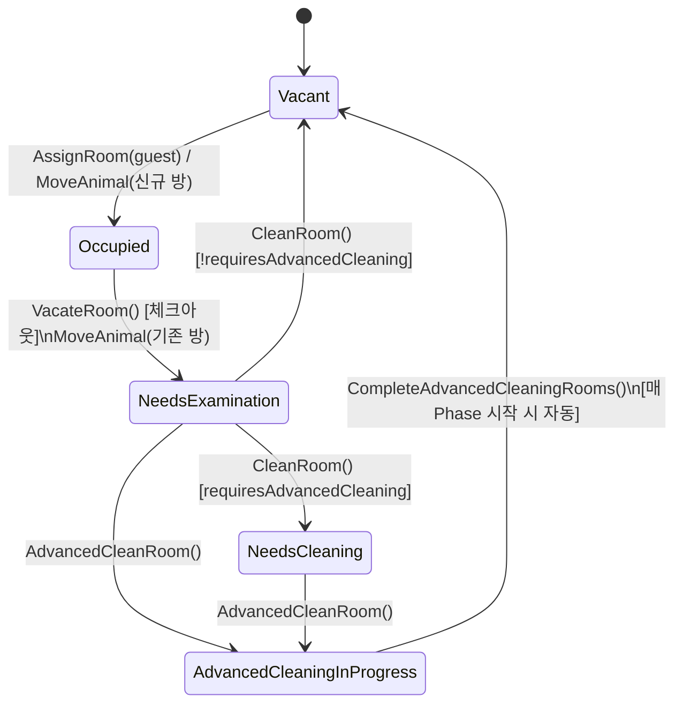
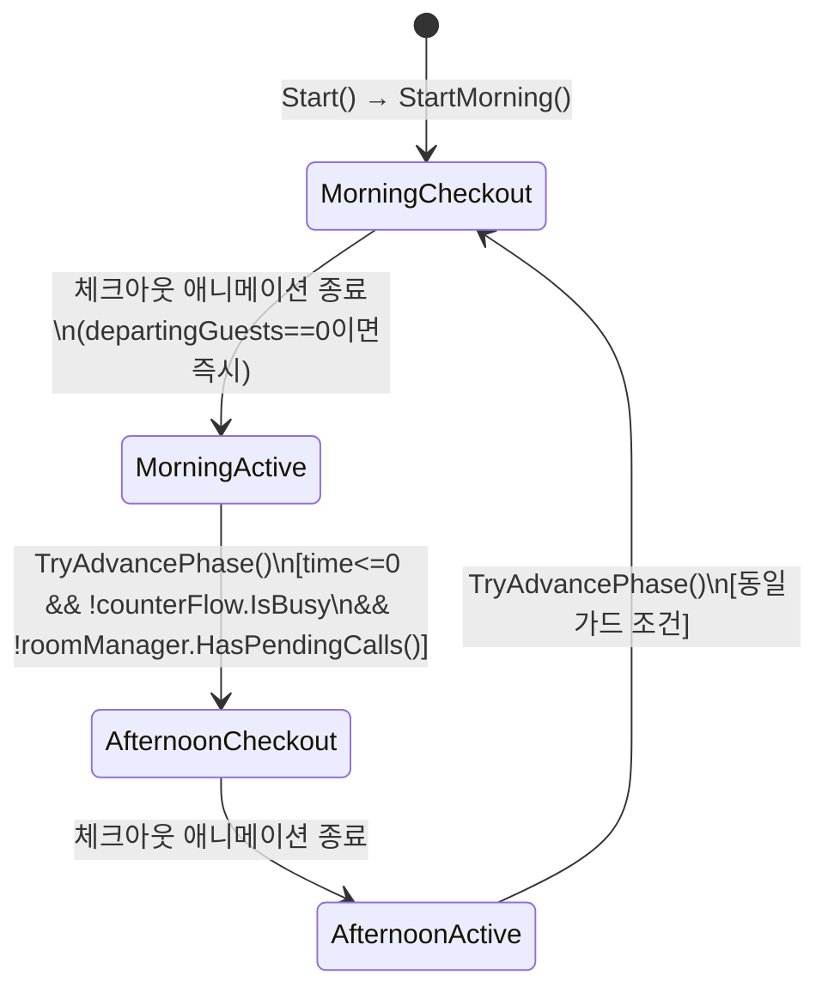
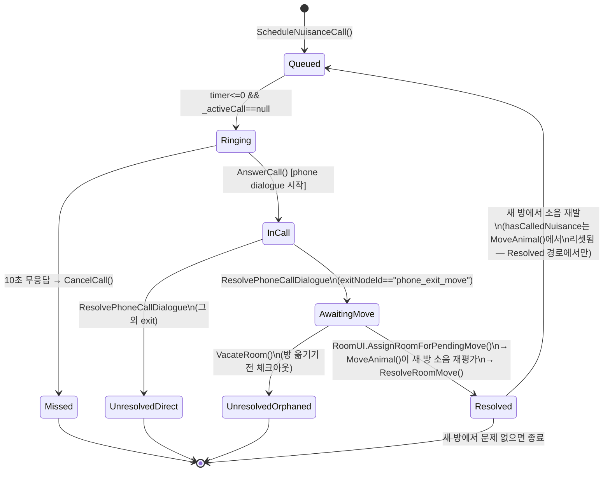
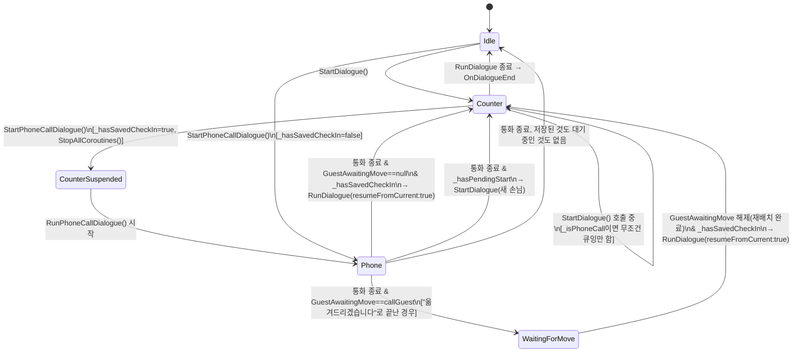

# State Diagram 정리 + 상태 전이 관련 버그 감사

관련 클래스: `RoomManager`, `DayManager`, `CounterFlow`, `DialogueManager`, `RoomUI`, `PhoneCallController`

## 0. 왜 이 문서가 필요한가

이 프로젝트에는 "State"라는 이름의 클래스나 enum이 하나로 모여있지 않고, 성격이 다른 **네 가지 상태 머신이 각자 다른 클래스에 암묵적으로** 흩어져 있다.

| # | 상태 머신 | 소유 클래스 | 표현 방식 |
|---|---|---|---|
| 1 | 방(Room) 생명주기 | `RoomManager` | `enum RoomStatus` (명시적) |
| 2 | 하루 시간대(Day/Phase) | `DayManager` | `bool IsMorning` + `bool IsCheckoutInProgress` + `float PhaseTimeRemaining` 조합 (암묵적) |
| 3 | 민원 전화(Nuisance Call) 생명주기 | `RoomManager` (`PendingCall`, `_activeCall`, `GuestAwaitingMove`) | 여러 필드 조합 (암묵적) |
| 4 | 대화 컨텍스트(카운터 ↔ 전화 인터럽트) | `DialogueManager` | `bool _isPhoneCall` + `_hasSavedCheckIn`/`_hasPendingStart` 조합 (암묵적) |

암묵적 상태(2, 3, 4)일수록 "전이 규칙이 코드 여러 곳에 흩어져 있다"는 뜻이고, 실제로 `Docs/nuisance-call-pipeline.md`와 `Docs/dialogue-bubble-interrupt-pipeline.md`에 기록된 과거 버그들이 전부 이 세 상태 머신에서 나왔다. 아래 다이어그램은 코드를 그대로 반영한 as-is 상태이며, 각 다이어그램 밑에 다이어그램을 그리는 과정에서 드러난 버그를 바로 붙여뒀다.

---

## 1. Room 생명주기 (`RoomManager.RoomStatus`)



> **후속 확인 결과 (개발자 코멘트): A, B 둘 다 버그 아님 — 의도한 설계.** 자세한 내용은 6절 참고. `CleanRoom()`이 `requiresAdvancedCleaning`인 방에서 시간 소모 없이 `NeedsCleaning`으로만 전이하는 것도, `AdvancedCleanRoom()`이 실제 필요 여부와 무관하게 진행되는 것도 전부 "방 상태를 몰라도 일반 청소를 시도하며 알아낼 수 있고, 이미 아는 플레이어는 고급 청소로 바로 건너뛸 수 있게" 하려는 의도적 설계다. 아래 원래 분석은 기록 목적으로 남겨둔다.

**버그 후보 A (기각) — `NeedsCleaning` 상태에서 일반 청소로 빠져나갈 길이 없음.** `CleanRoom()`은 `status == NeedsCleaning`이면 경고만 로그하고 `false`를 반환한다(`RoomManager.cs:235-239`). `RoomUI.canClean`도 `status == NeedsExamination`일 때만 true라 UI상 막혀있긴 하지만, `AdvancedCleanRoom()`을 건너뛴 채 `NeedsCleaning`에 도달할 경로가 코드상 없다는 보장이 상태 다이어그램만으로는 확인되지 않는다 — 오직 "UI가 실수로 막아주고 있을 뿐"이다. → 실제로는 `NeedsCleaning`이 막다른 상태가 아니라 "고급 청소가 필요하다는 걸 알아낸 상태"이고, 거기서 나가는 유일한 길이 `AdvancedCleanRoom()`인 게 맞다.

**버그 후보 B (기각) — `AdvancedCleanRoom()`이 `requiresAdvancedCleaning` 여부를 검사하지 않음.** `NeedsExamination` 상태면 실제로 고급 청소가 필요한지와 무관하게 무조건 `AdvancedCleaningInProgress`로 전이한다(`RoomManager.cs:245-259`). → 의도한 동작. 그 방은 고급 청소가 시작된 시간대엔 배정 불가능해지므로, 이 비용이 "묻지마 고급 청소 남용"을 억제하는 장치다.

---

## 2. 하루 시간대(Day/Phase) — 암묵적 상태 머신

`IsMorning`(bool) × `IsCheckoutInProgress`(bool) × `PhaseTimeRemaining`(float) 세 값의 조합이 사실상 하나의 상태를 이룬다. 코드에 명시적 enum은 없지만, 실제로 의미 있는 조합만 뽑으면 아래와 같다.



`IsTimeFlowing`(체감상 "시계가 도는가")는 이 상태들과 별개 축으로 겹쳐 있다: `IsCheckoutInProgress`면 무조건 멈추고, 그게 아니어도 `PhaseTimeRemaining<=0 && counterFlow.IsBusy`면 멈춘다. 즉 실제로는 이 다이어그램의 각 상태 안에 "시계가 도는 서브상태 / 멎은 서브상태"가 또 있다 — **하나의 bool(`IsTimeFlowing`)이 사실상 3개 조건의 AND/OR 조합을 매 프레임 재계산하는 파생 상태**라는 뜻이다.

**버그 후보 C — `TryAdvancePhase()`의 가드 조건이 세 곳(`IsCheckoutInProgress`, `counterFlow.IsBusy`, `roomManager.HasPendingCalls()`)에 나뉘어 있고, 이 세 값의 진짜 소유자가 세 개의 다른 클래스(`DayManager`, `CounterFlow`, `RoomManager`)다.** 지금은 잘 맞물려 있지만(문서화도 잘 돼 있음), 넷째 조건을 추가해야 하는 시점(예: 튜토리얼 팝업, 이벤트 연출)이 오면 또 다른 클래스가 `TryAdvancePhase()` 내부를 직접 고쳐야 한다 — "시간대 전환을 막을 수 있는 조건" 자체가 열거형이나 인터페이스로 추상화돼 있지 않기 때문이다.

---

## 3. 민원 전화(Nuisance Call) 생명주기



`Resolved → Queued`로 돌아가는 루프는 최대 몇 바퀴든 반복될 수 있다(옮긴 방에서 또 문제가 생기면 또 옮기고, 또 생기면 또 옮기고 …). `nuisanceComplaintCount`가 이번 체류 동안 이 루프를 몇 번 돌았는지 세고, `Missed`/`UnresolvedDirect`/`UnresolvedOrphaned`로 끝나면(즉 `Unresolved`로 확정되면) `hasCalledNuisance`가 다시는 안 풀리므로 이 손님은 그 길로 완전히 종료된다 — 루프는 오직 `Resolved`로 끝난 뒤에만 다시 열린다.

이 상태 머신은 `Docs/nuisance-call-pipeline.md`에서 이미 세 차례 리팩토링된 이력이 있고(동시 링잉 버그, 체크아웃 레이스 수정, 재발 민원 미처리), 현재 구조는 견고한 편이다. 다만 다이어그램으로 그려보면 두 가지가 새로 보인다.

> **후속 확인 결과: `OnAssignButtonClicked()`가 `GuestAwaitingMove`를 최우선 처리하는 것 자체는 의도한 동작.** "방을 재배정하기 전까지 새 투숙객 숙박 배정이 일어나면 안 된다"는 요구사항과 정확히 일치한다. 다만 이 규칙이 Assign 버튼 하나에만 적용돼 있고, 같은 시간대에 함께 지켜져야 하는 두 가지가 코드에서 빠져 있었다 — 아래 D-1/D-2로 정리하고 둘 다 수정 완료했다.

**원래 버그 후보 D — `RoomUI.OnAssignButtonClicked()`가 `AwaitingMove` 상태를 무조건 최우선으로 처리한다.** 코드:

```csharp
var moveGuest = roomManager.GuestAwaitingMove;
if (moveGuest != null)
{
    AssignRoomForPendingMove(moveGuest);
    return;   // ← 체크인 중인 다른 손님을 배정하려던 클릭이었어도 여기서 가로채짐
}
```

이 동작 자체(방 이동을 체크인 배정보다 우선)는 의도한 설계였다. 다이어그램으로 파고들어 실제로 발견된 건 이 규칙이 **부분적으로만** 지켜지고 있었다는 점이다.

**D-1 (실제 버그, 수정 완료) — `GuestAwaitingMove`가 걸려있는 동안 새 손님이 계속 카운터로 들어올 수 있었다.** `CounterFlow.SpawnCustomerRoutine()`은 `_isSpawning`과 `dayManager.IsCheckoutInProgress`만 확인했지 `GuestAwaitingMove`는 전혀 보지 않았다 — "새 고객이 들어오는 일은 방을 재배정하기 전까지 일어나면 안 된다"는 규칙 위반. `SpawnCustomerRoutine()` 진입부에 `dayManager.roomManager.GuestAwaitingMove != null`이면 즉시 `yield break`하는 가드를 추가했다(`CounterFlow.cs`). 이 가드로 멈춘 스폰 루프는 방 이동이 실제로 완료된 시점(`RoomUI.AssignRoomForPendingMove()` → `HandleFlowAfterMoveResolved()`)에 다시 깨워준다.

**D-2 (실제 버그, 수정 완료) — 통화가 끝나도 다른 대기 콜의 타이머가 다시 돌기 시작했다.** `RoomManager.Update()`의 정지 조건이 `if (_activeCall != null) return;` 하나뿐이었다. 전화 대화 자체는 `ResolvePhoneCallDialogue()` 시점에 끝나며 `_activeCall = null`로 즉시 풀리는데, 이때 `GuestAwaitingMove`는 여전히 non-null(방을 아직 안 옮겼음)이어도 다른 대기 콜의 타이머가 다시 감소하기 시작해 울릴 수 있었다 — "추가 전화 송신은 방을 재배정하기 전까지 일어나면 안 된다" 규칙 위반. 정지 조건을 `if (_activeCall != null || GuestAwaitingMove != null) return;`로 확장했다(`RoomManager.cs`). (다른 대기 콜의 타이머를 완전히 멈출지, 감소는 시키되 울리는 것만 막을지 확인 결과 — **완전 정지**로 결정. 기존 `_activeCall` 프리즈와 동일한 방식이라 일관성이 있다.)

**추가 개선 (신규 요청, 구현 완료) — 그 방 이동이 이번 시간대의 마지막 처리 항목이었다면 자동으로 다음 시간대로 넘어간다.** `RoomUI.HandleFlowAfterMoveResolved()`: 방을 옮긴 직후 `roomManager.HasPendingCalls()`가 false(이 이동 자체가 새 민원을 만들지 않았음)이고 `dayManager.PhaseTimeRemaining <= 0`(게임 시간도 이미 소진)이면, 태블릿을 자동으로 닫고(`TabletController.Close()`) 곧바로 `dayManager.TryAdvancePhase()`를 호출한다. 아직 시간이 남아있거나 이 이동이 새 민원을 만들었다면(`HasPendingCalls()`가 여전히 true) 자동 전환은 하지 않고, 대신 D-1에서 멈춰 있던 `CounterFlow`를 깨워 원래 체크인 흐름으로 되돌아간다.

**버그 후보 E — 통화 중 방 배정 전면 잠금 (신규 요구사항, 수정 완료).** 개발자 확인 결과, 통화가 진행되는 동안(`_activeCall != null` — 벨이 울리는 순간부터 통화 다이얼로그가 완전히 끝날 때까지)에는 **민원을 건 동물은 물론, 그 순간 체크인 중이던 새 투숙객의 방 배정도 함께 잠겨야 한다.** 통화가 "옮겨드리겠습니다"로 끝나면 `GuestAwaitingMove` 경로로, "못 옮겨드립니다"로 끝나면(또는 처음부터 약속이 없었으면) 곧장 원래 체크인 배정 흐름으로 복귀한다.

`RoomManager`에 `public bool IsCallActive => _activeCall != null;`를 새로 노출하고, `RoomUI.OnAssignButtonClicked()` 맨 앞에서 이 값이 true면 무조건 막도록 수정했다(`RoomUI.cs`). `RefreshAssignButton()`의 `canAssign` 계산에도 반영해 버튼 색상이 잠금 상태를 정확히 보여주도록 했다. `IsCallActive`와 `GuestAwaitingMove`는 D-2 수정 덕분에 동시에 참일 수 없으므로(콜이 활성인 동안엔 다른 콜도, 이미 확정된 이동도 동시에 진행되지 않음) 두 상태 사이에 빈틈없이 이어진다.

**E-2 (실제 버그, 추가 발견 및 수정 완료) — 통화가 "옮겨드리겠습니다"로 끝나자마자, 재배치를 기다리지 않고 곧바로 원래 체크인 대화로 복귀했다.** `RunPhoneCallDialogue()`가 `OnPhoneCallDialogueEnd`를 쏘고 나면(이 시점에 `RoomManager.GuestAwaitingMove`가 이미 동기적으로 세팅됨) `_hasSavedCheckIn`이면 곧장 `StartCoroutine(RunDialogue(resumeFromCurrent:true))`를 호출해 저장해둔 체크인 대화를 재개했다 — 민원 동물의 방을 실제로 옮기기 전인데도 새 투숙객과의 대화가 먼저 돌아왔다. "민원부터 먼저 처리한 뒤에 투숙객 흐름으로 돌아가야 한다"는 의도와 반대였다. `RunPhoneCallDialogue()`에 `yield return new WaitUntil(() => roomManager.GuestAwaitingMove != callGuest);`를 추가해서, 이 통화가 방 이동을 약속했다면(`GuestAwaitingMove == callGuest`) 그 재배치가 실제로 끝날 때까지(`RoomUI.ResolveRoomMove()`가 `GuestAwaitingMove`를 지울 때까지) 재개 자체를 미루도록 했다. 약속이 없었던 통화라면 조건이 이미 참이라 대기 없이 그대로 진행된다.

**E-3 (요구사항 추가, 수정 완료) — 재배치가 끝나도 태블릿(방 배정 UI)이 열려있는 동안엔 계속 유예.** E-2만으로는 `GuestAwaitingMove`가 풀리는 즉시(플레이어가 Assign을 클릭한 그 프레임) 대화가 재개돼, 방금 클릭한 태블릿 패널이 아직 화면에 열려있는 상태에서 새 투숙객 대화가 그 뒤/아래로 튀어나올 수 있었다. `GuestAwaitingMove` 대기 뒤에 `yield return new WaitUntil(() => !tabletController.IsOpen);`를 추가해서, 플레이어가 태블릿을 직접 닫을 때까지 재개를 한 번 더 미루도록 했다. 방 이동 약속이 아예 없었던 통화라면 이 시점에 태블릿이 열려있을 이유가 보통 없으므로 실질적으로 대기가 발생하지 않는다. 참고로 이 시간대의 마지막 처리 항목이라 태블릿이 자동으로 닫히는 경우(`RoomUI.HandleFlowAfterMoveResolved()`의 자동 전환 분기)에도 `TabletController.Close()`가 `IsOpen`을 false로 만들어주므로 이 대기 조건과 자연스럽게 맞물린다.

> **원래 있던 별개 지적 — `Docs/dialogue-bubble-interrupt-pipeline.md` 6절의 "AssignRoomForPendingMove()에 NotifyRoomAssigned() 호출 누락" 항목은 재검토가 필요해 보인다.** `AssignRoomForPendingMove()`가 배정하는 대상은 민원을 건 동물(`moveGuest`)인데, 이 동물의 대화 트리(`DialogueTreeBuilder.BuildPhoneCallTree`)에는애초에 `_roomAssigned`로 잠기는 "방 배정" 선택지가 없어 보인다(그 선택지 게이트는 카운터 체크인 트리 전용). 그렇다면 그 지점에서 `NotifyRoomAssigned(moveGuest)`를 호출해도 `CurrentGuest`/`_savedGuest` 어느 쪽과도 안 맞아 아무 효과가 없을 것 같다 — 이번엔 이 호출을 추가하지 않았다. 혹시 민원 동물의 대화 트리에도 방 배정으로 잠기는 선택지가 실제로 존재한다면 알려달라, 그럼 그 경로에도 `NotifyRoomAssigned(moveGuest)` 호출을 추가하겠다.

---

## 4. 대화 컨텍스트 (카운터 ↔ 전화 인터럽트) — `DialogueManager`



`ActiveCustomerBubble`/`ActiveStaffBubble`는 이 다이어그램의 "현재 상태"가 아니라 **`_isPhoneCall`이라는 단일 bool 하나만 보고** 어떤 Bubble을 쓸지 고른다(`_isPhoneCall ? phone... : counter...`).

**버그 후보 F — `NotifyRoomAssigned()`가 `_isPhoneCall` 시점의 Bubble을 잘못 조작할 수 있음 (수정 완료).** `Counter` 상태의 손님(체크인 중인 손님 B, `CounterFlow._currentGuest`는 인터럽트와 무관하게 그대로 유지됨)이 "방 배정" 선택지를 기다리는 도중, 다른 민원 전화가 걸려와 `Phone` 상태(정확히는 `CounterSuspended → Phone`)로 넘어갔다고 하자. 이때 플레이어가 여전히 화면에 남아있는 B의 방을 골라 Assign을 누르면(RoomUI는 대화 상태를 모르므로 클릭 자체는 정상 처리됨) `dialogueManager.NotifyRoomAssigned()`가 호출되는데, 이 시점 `_isPhoneCall == true`이므로:

```csharp
public void NotifyRoomAssigned()
{
    _roomAssigned = true;
    if (_hasSavedCheckIn) { _savedRoomAssigned = true; }   // 내부 플래그는 정상 저장됨
    if (ActiveStaffBubble != null)
    {
        ActiveStaffBubble.EnableAssignChoices();   // ← phoneStaffBubble에서 호출됨 (오답)
    }
}
```

`_savedRoomAssigned`는 맞게 저장되지만, 정작 "방 배정" 버튼이 그려져 있는 실제 인스턴스는 (인터럽트 당하며 화면에 그대로 남아있는) **`staffBubble`인데, `EnableAssignChoices()`는 `phoneStaffBubble`에서 호출된다.** `phoneStaffBubble`에는애초에 그 버튼이 없으므로 이 호출은 조용히 아무 효과가 없다.

**수정.** `NotifyRoomAssigned()`를 `NotifyRoomAssigned(Animal guest)`로 바꿔서 "지금 `_isPhoneCall` 값"이 아니라 "이 알림이 실제로 누구 것인지"를 직접 비교하도록 했다(`DialogueManager.cs`).

```csharp
public void NotifyRoomAssigned(Animal guest)
{
    if (guest == null) return;

    if (guest == CurrentGuest)
    {
        _roomAssigned = true;
        ActiveStaffBubble?.EnableAssignChoices();
    }
    else if (_hasSavedCheckIn && guest == _savedGuest)
    {
        _savedRoomAssigned = true;   // Bubble은 건드리지 않음 — 재개 시 값 기준으로 다시 그려짐
    }
    else
    {
        Debug.LogWarning(...);
    }
}
```

호출부(`RoomUI.OnAssignButtonClicked()`)도 `dialogueManager.NotifyRoomAssigned(guest)`로 guest를 넘기도록 갱신했다. 참고로 이번에 함께 고친 **버그 후보 E(통화 중 배정 전면 잠금)** 덕분에, F를 실제로 유발하던 시나리오(통화 중에 여전히 화면에 남아있는 체크인 손님의 방을 배정하는 것) 자체가 이제 `OnAssignButtonClicked()` 초입에서 막힌다 — 즉 F는 이번 라운드에 "원인(E)도 막히고, 구조(guest 파라미터화)도 고쳐진" 이중으로 안전해진 상태다. **버그 후보 D/E/F는 전부 "현재 활성 컨텍스트 하나만 보고 분기한다"는 같은 패턴에서 나왔고, 이번 라운드에서 그 패턴 자체(D-1/D-2/E의 조건 분기, F의 guest 파라미터화)를 고쳤다.**

---

## 5. 버그 후보 요약

| ID | 위치 | 상태 | 증상 |
|---|---|---|---|
| A | `RoomManager.CleanRoom()` | **기각 — 의도한 설계** (개발자 확인) | 없음. 일반 청소로 "고급 청소 필요함"을 알아내거나, 이미 아는 경우 곧장 고급 청소로 건너뛸 수 있게 하려는 의도 |
| B | `RoomManager.AdvancedCleanRoom()` | **기각 — 의도한 설계** (개발자 확인) | 없음. 필요 여부 확인 없이 진행 가능하되, 그 시간대 배정 불가 비용으로 남용을 억제 |
| C | `DayManager.TryAdvancePhase()` | 설계와 일치 확인, 다만 D-1/D-2 gap이 있었음 | 가드 3개(`IsCheckoutInProgress`/`counterFlow.IsBusy`/`HasPendingCalls`) 자체는 요구사항과 정확히 일치 |
| D-1 | `CounterFlow.SpawnCustomerRoutine()` | **실제 버그, 수정 완료** | `GuestAwaitingMove` 대기 중에도 새 손님이 카운터로 계속 들어올 수 있었음 |
| D-2 | `RoomManager.Update()` | **실제 버그, 수정 완료** | 통화 종료 직후(`_activeCall=null`) `GuestAwaitingMove`가 남아있어도 다른 대기 콜 타이머가 재개돼 울릴 수 있었음 |
| D-추가 | `RoomUI.HandleFlowAfterMoveResolved()` (신규) | **기능 추가, 구현 완료** | 방 이동이 그 시간대의 마지막 처리 항목이면 태블릿 자동 닫힘 + 시간대 자동 전환 |
| E | `RoomManager.IsCallActive`, `RoomUI.OnAssignButtonClicked()` | **실제 요구사항, 수정 완료** | 통화가 진행되는 동안(벨~다이얼로그 종료) 민원 동물·새 투숙객 양쪽 다 방 배정 불가하도록 전면 잠금 |
| F | `DialogueManager.NotifyRoomAssigned(Animal guest)` | **수정 완료 (E 덕분에 유발 경로도 함께 막힘)** | `_isPhoneCall` 대신 guest 파라미터로 실제 소유 컨텍스트(`CurrentGuest`/`_savedGuest`)를 직접 비교 |
| — | `RoomUI.OnRoomAssigned` | **기존 문서화됨, 아직 미수정** | 구독자 없는 죽은 이벤트 |
| — | `Docs/dialogue-bubble-interrupt-pipeline.md` 6절의 "AssignRoomForPendingMove에 NotifyRoomAssigned 누락" | **재검토 필요 — 개발자 확인 요청** | `moveGuest`(민원 동물)의 전화 대화 트리에 `_roomAssigned`로 잠기는 선택지가 실제로 있는지 불확실. 없다면 이 지적 자체가 해당 없음 |
| E-2 | `DialogueManager.RunPhoneCallDialogue()` | **실제 버그, 수정 완료** | 통화가 "옮겨드리겠습니다"로 끝나자마자 민원 재배치를 기다리지 않고 곧장 체크인 대화가 재개됐음. `GuestAwaitingMove` 해제까지 `WaitUntil`로 대기하도록 수정 |
| E-3 | `DialogueManager.RunPhoneCallDialogue()` | **요구사항 추가, 수정 완료** | 재배치가 끝나도 태블릿(방 배정 UI)이 열려있으면 계속 대기, 플레이어가 직접 닫아야 재개 |
| G | `RoomManager.ScheduleNuisanceCall()` / `Animal.hasCalledNuisance` | **실제 버그, 수정 완료** | 방을 옮긴 손님이 새 방에서 또 소음 피해를 입어도 `hasCalledNuisance`가 영구히 true라 재발신이 원천 차단돼 있었음. `MoveAnimal()`에서 `Resolved` 경로에 한해서만 리셋하도록 수정, `nuisanceComplaintCount` 신설해 "부분 해결(4~6점)" 평점 등급 구현 |
| H | `RoomUI.OnAssignButtonClicked()` / `RefreshAssignButton()` | **실제 버그(소프트락), 수정 완료** | `CounterFlow.GetCurrentGuest()`는 손님이 대기열에서 뽑히자마자(입장 애니메이션·대화 시작 전) 그 손님을 반환하기 시작한다. 이 시점에 플레이어가 Assign을 누르면 `RoomManager.AssignRoom()`은 성공(방이 Occupied로 바뀜)하지만 `DialogueManager.CurrentGuest`는 아직 그 손님이 아니라서 `NotifyRoomAssigned()`가 조용히 무시된다(F에서 추가한 경고 로그로 발견됨). 이후 그 손님의 실제 대화가 시작돼도 `_roomAssigned`가 끝내 true가 안 되고, 방은 이미 Occupied라 재배정도 안 되므로 "방 배정" 선택지가 영구히 비활성 상태로 멎는다 — 새 손님 체크인 대화가 그대로 멈춰버리는 소프트락. `dialogueManager.CurrentGuest == guest`(대화가 실제로 시작됐는지)를 배정 조건에 추가해서 막았다 |

---

## 6. Trade-off 분석 — "다이어그램만 그리기" vs "명시적 State Machine으로 리팩토링"

| 옵션 | 장점 | 단점 |
|---|---|---|
| **A. 문서(다이어그램)만 유지, 코드는 그대로** | 비용 최소, 지금처럼 버그 발견 즉시 각 지점만 패치 가능 | 문서와 코드가 시간이 지나며 drift됨. 상태 D/E/F처럼 "같은 패턴이 여러 곳에서 반복되는" 종류의 버그는 근본적으로 안 줄어듦 — 다음에 다섯째 대화 컨텍스트나 여섯째 방 상태가 추가되면 또 같은 실수가 반복될 확률이 높음 |
| **B. 전면 FSM 프레임워크 도입 (Room/Phase/Call/Dialogue 전부 명시적 State 클래스 + 전이 테이블)** | 잘못된 전이를 컴파일/런타임에서 원천 차단, 테스트 작성이 쉬워짐 | 방 10개·상태 5개짜리 도메인에 과설계 위험. `RoomManager`(739줄)·`DialogueManager`가 이미 nuisance/청소/전화/애니메이션 타이밍까지 얽혀 있어 리팩토링 범위가 이번 기능 추가보다 커짐. 지금 당장 버그(D/E)를 고치는 데 필요한 것보다 훨씬 많은 작업 |
| **C. 최소 침습 리팩토링 — 버그가 실제로 나오는 지점(D/E/F)만, "현재 상태를 명시적으로 물어보는" 헬퍼로 국소 교체** | 리팩토링 범위가 작고 지금 발견된 버그 3개를 구조적으로 재발 방지함. 기존 아키텍처(이벤트 기반, `RoomManager`/`DialogueManager` 분리)는 그대로 유지 | 상태 A/B/C(방 청소, Phase 가드)는 이번 라운드에서 다루지 않고 그대로 남음 — 별도 후속 작업 필요 |

**권장: C.** 지금 규모(단일 씬, 방 10개, 대화 컨텍스트 2개)에서 B는 비용 대비 얻는 게 적다. 반면 D/E/F는 전부 "여러 진입점이 하나의 암묵적 상태 변수를 서로 다르게 해석한다"는 동일한 근본 원인을 공유하므로, 아래 세 가지 국소 리팩토링으로 재발까지 함께 막을 수 있다.

### 6-1. 클래스 디자인 제안 (버그 D 대응)

`RoomUI.OnAssignButtonClicked()`가 `GuestAwaitingMove`와 `counterFlow.GetCurrentGuest()`를 순서대로 검사해 우선순위를 암묵적으로 정하는 대신, "이 Assign 클릭이 지금 무엇을 하려는 것인가"를 명시적인 값으로 먼저 계산하고 그 값에 따라 분기하도록 바꾼다.

```csharp
private enum AssignIntent { None, PromisedMove, CheckIn }

private AssignIntent GetCurrentAssignIntent()
{
    if (roomManager.GuestAwaitingMove != null) return AssignIntent.PromisedMove;
    if (counterFlow != null && counterFlow.GetCurrentGuest() != null) return AssignIntent.CheckIn;
    return AssignIntent.None;
}
```

이렇게 분리하면 ①`RefreshAssignButton()`에서 지금 Assign 버튼이 "이동 완료용"인지 "체크인 배정용"인지 라벨/색상으로 구분해 보여줄 수 있고(현재는 둘 다 같은 버튼·같은 라벨), ②두 의도가 동시에 존재하는 경우(D의 시나리오)를 코드에서 명시적으로 감지해 로그를 남기거나, 두 요청을 큐잉하는 등의 정책을 고를 수 있는 지점이 생긴다. 지금은 그 동시 발생 자체가 코드 어디에도 드러나지 않는다.

### 6-2. 클래스 디자인 제안 (버그 E/F 대응)

`DialogueManager`가 "지금 진행 중인 대화가 카운터 것인지 전화 것인지"를 `_isPhoneCall` bool 하나로만 판단하는 대신, `NotifyRoomAssigned()`처럼 **특정 손님(guest)에 대한 알림**은 그 guest가 현재 어느 컨텍스트에 속해 있는지를 직접 찾아서 해당 컨텍스트의 리소스에만 적용하도록 바꾼다.

```csharp
public void NotifyRoomAssigned(Animal guest)
{
    if (guest == CurrentGuest)
    {
        _roomAssigned = true;
        ActiveStaffBubble?.EnableAssignChoices();   // 현재 컨텍스트가 guest 소유가 맞을 때만
    }
    else if (guest == _savedGuest)
    {
        _savedRoomAssigned = true;                  // 인터럽트로 잠들어 있는 컨텍스트는 값만 저장,
        // 재개(RunDialogue resumeFromCurrent) 시 저장된 값 기준으로 버튼이 다시 만들어지므로 여기서 Bubble을 직접 건드리지 않는다.
    }
}
```

호출부(`RoomUI.OnAssignButtonClicked`, `AssignRoomForPendingMove` 둘 다)는 `dialogueManager.NotifyRoomAssigned(guest)`처럼 **누구에 대한 알림인지**를 넘기도록 통일한다. 이러면 버그 E(호출 누락)는 "두 Assign 경로 모두 같은 메서드를 같은 시그니처로 호출해야 한다"는 게 코드 상에서 강제되고, 버그 F(잘못된 Bubble 선택)는 "현재 `_isPhoneCall` 값"이 아니라 "이 guest가 속한 컨텍스트"를 직접 비교하므로 구조적으로 사라진다.

### 6-3. 지금 하지 않는 것

Room 상태(A/B)와 Phase 가드(C)는 이번에 함께 고치지 않는다. 둘 다 "지금 당장 플레이어가 체감하는 버그"가 아니라 향후 유지보수 비용에 가깝고, 이번 발견은 D/E/F와 원인이 다르다(전이 가드 누락 vs 다중 진입점 동기화) — 같은 커밋에 묶으면 리뷰 범위만 커진다. 다음 라운드에서 `RoomManager`에 `TryTransitionRoom(int roomNumber, RoomStatus to)` 같은 단일 전이 지점을 만들 때 함께 처리하는 걸 권장한다.

## 7. 관련 코드 위치

| 역할 | 파일 |
|---|---|
| Room 상태 전이 | `Assets/Scripts/Managers/RoomManager.cs` → `AssignRoom`, `MoveAnimal`, `VacateRoom`, `CleanRoom`, `AdvancedCleanRoom`, `CompleteAdvancedCleaningRooms` |
| Day/Phase 상태 | `Assets/Scripts/Managers/DayManager.cs` → `IsMorning`, `IsCheckoutInProgress`, `IsTimeFlowing`, `TryAdvancePhase` |
| Nuisance Call 상태 | `Assets/Scripts/Managers/RoomManager.cs` → `PendingCall`, `_activeCall`, `GuestAwaitingMove`, `ScheduleNuisanceCall`, `Update`, `AnswerCall`, `CancelCall`, `ResolvePhoneCallDialogue`, `ResolveRoomMove` |
| Assign 버튼 우선순위 (버그 D) | `Assets/Scripts/Room/RoomUI.cs:147-219` (`OnAssignButtonClicked`, `AssignRoomForPendingMove`) |
| 대화 컨텍스트 상태 (버그 E/F) | `Assets/Scripts/Managers/DialogueManager.cs:64-141` (`NotifyRoomAssigned`, `StartDialogue`, `StartPhoneCallDialogue`) |
